# Activity Diagrams

本文档整理系统主要功能的 Activity Diagram。每个流程使用一个 Mermaid `flowchart TD` 图，可直接复制到 FYP 报告或支持 Mermaid 的 Markdown 编辑器中。

## 1. Login and Registration Activity Diagram

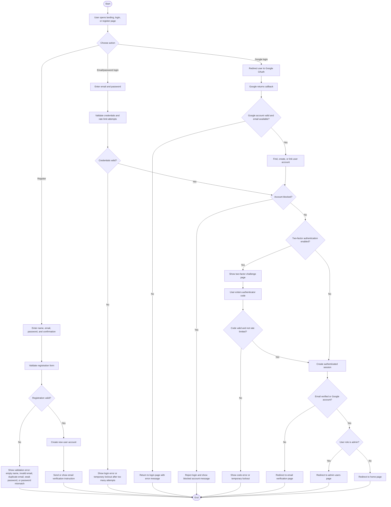

## 2. Create Post Activity Diagram

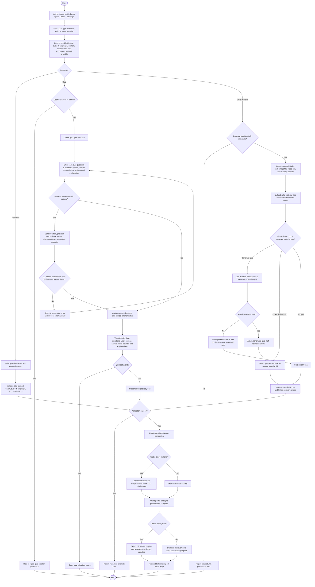

## 3. Switch Language Activity Diagram

此图覆盖语言切换、session/cookie/user preference 保存，以及 Inertia shared props 更新。系统支持 `en`、`zh`、`my`。

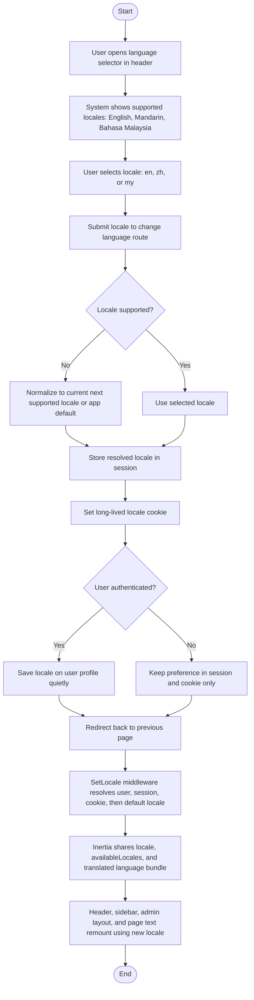

## 4. AI Learning Tools Activity Diagram

此图覆盖 AI translate、quiz explanation、quiz option generation、material quiz generation、best answer explanation、answer feedback、learning objectives、doubt clarification 和 wrong-answer validation。

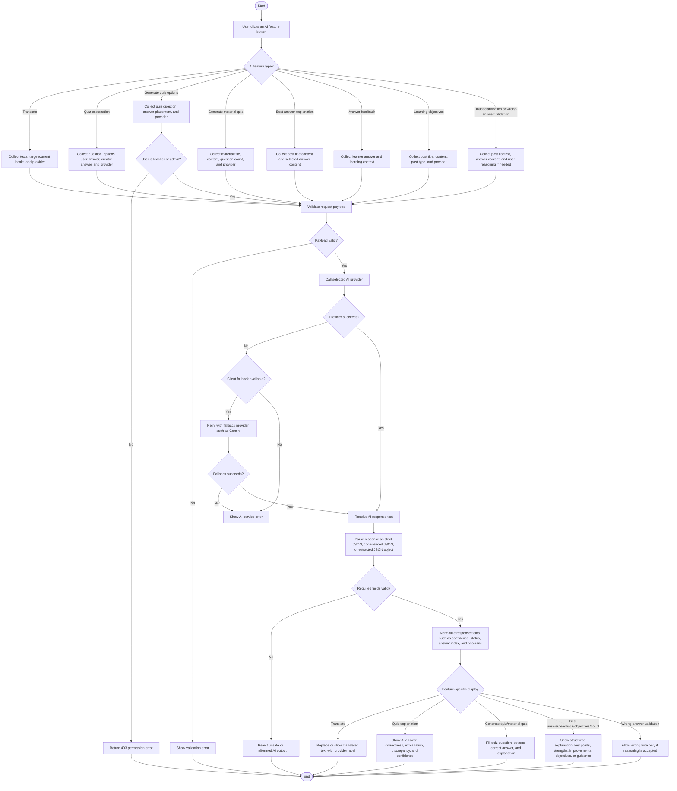

## 5. Follow and Unfollow Activity Diagram

此图覆盖用户从 profile、feed 或 post author section 关注/取消关注，以及 following feed 的影响。

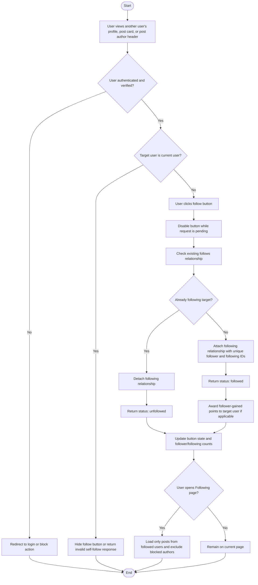

## 6. Bookmark and Study Folder Activity Diagram

此图覆盖保存帖子、取消保存、创建/改名/删除文件夹、移动收藏内容，以及 completed/correct/wrong quiz review，包括 quiz 错题收藏夹式复习。

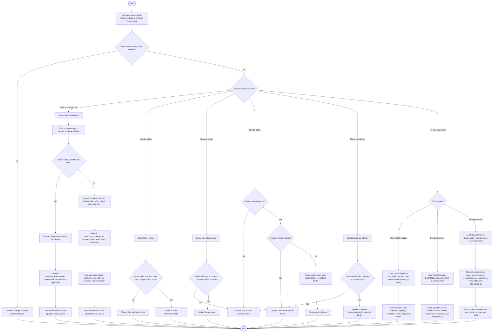

## 7. Achievements Activity Diagram

此图覆盖用户行为如何更新 progress、points、badges 和 progress-based achievements，以及 achievements page 的显示。

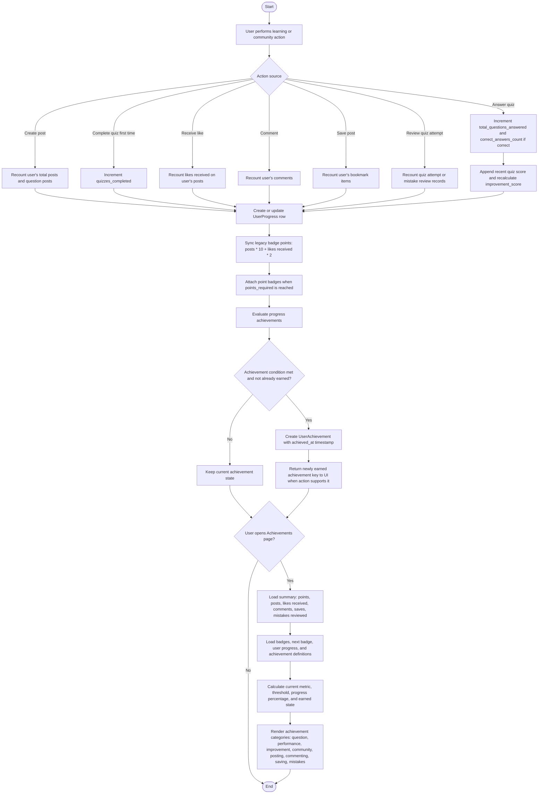

## 8. Leaderboard Activity Diagram

此图覆盖 all-time、weekly、monthly 排行榜、用户隐藏排名、称号显示、points history 和 pagination。

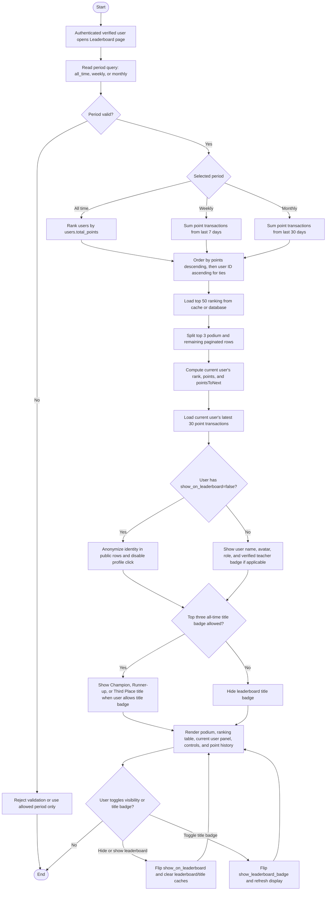

## 9. Teacher Certification Activity Diagram

此图覆盖用户提交教师认证、上传文件、admin 审核、approve/reject、教师 verified toggle，以及文件访问权限。

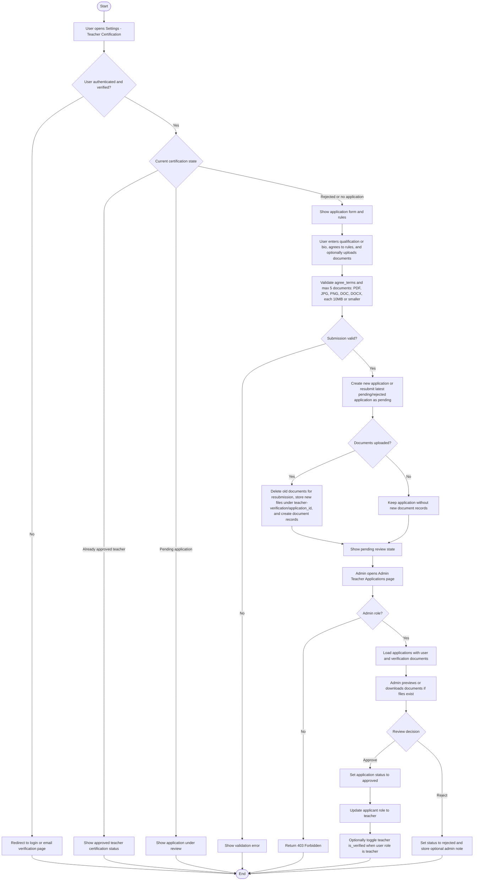

## 10. Comment Activity Diagram

此图覆盖 comment / reply 创建、编辑、删除、投票、Q&A best answer、wrong-answer validation，并先判断 post 是 Q&A/quiz 还是 study material。

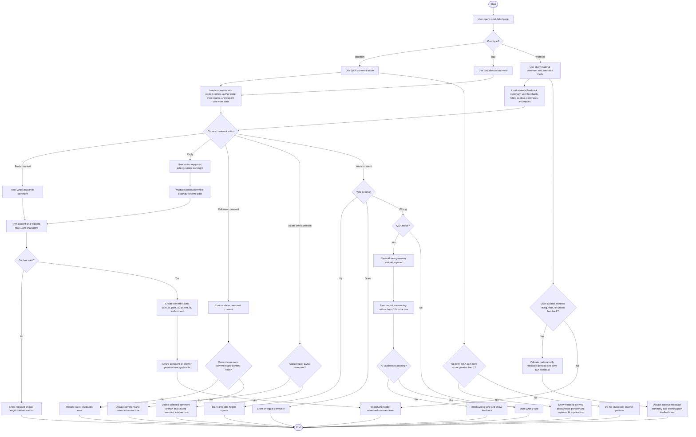

## 11. Admin Block User Activity Diagram

此图覆盖 admin 用户管理页、block/unblock、禁止 block admin、blocked user 后续访问处理，以及 blocked author 内容的隐藏逻辑。

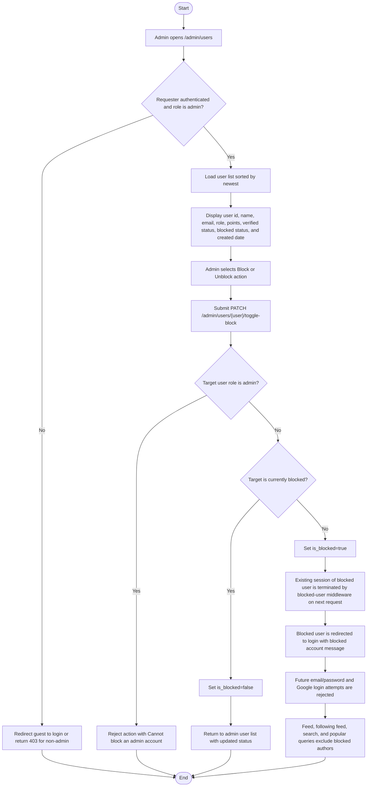

## 12. Report and Admin Moderation Activity Diagram

此图覆盖举报 post/comment、重复举报检查、admin reports 页面、dismiss report，以及 admin 根据举报删除内容后的处理。

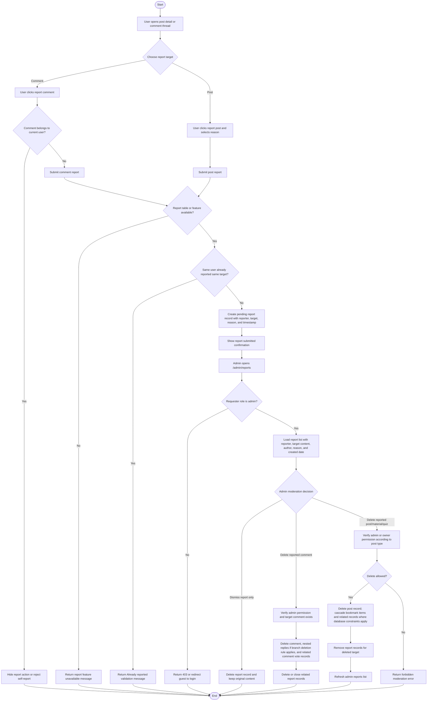
