# Core Activity and Sequence Diagrams

本文档整理本系统最重要的 6 个核心流程。每个流程都包含一个 Activity Diagram 和一个 Sequence Diagram，可直接用于 FYP 报告的系统设计章节。

## 1. User Authentication and Access Control

该流程覆盖用户登录、Google 登录回调、身份验证、邮箱验证，以及 blocked user / admin middleware 等访问控制。

### Activity Diagram

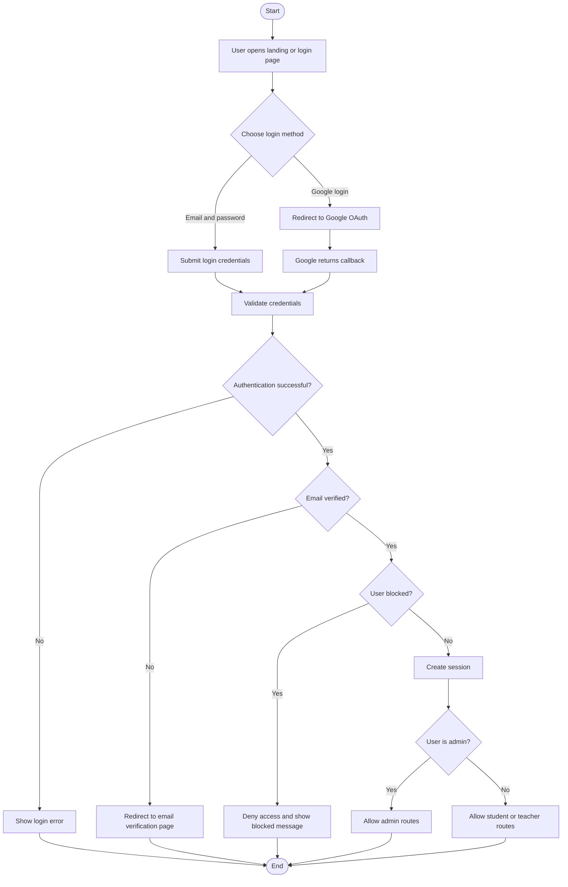

### Sequence Diagram

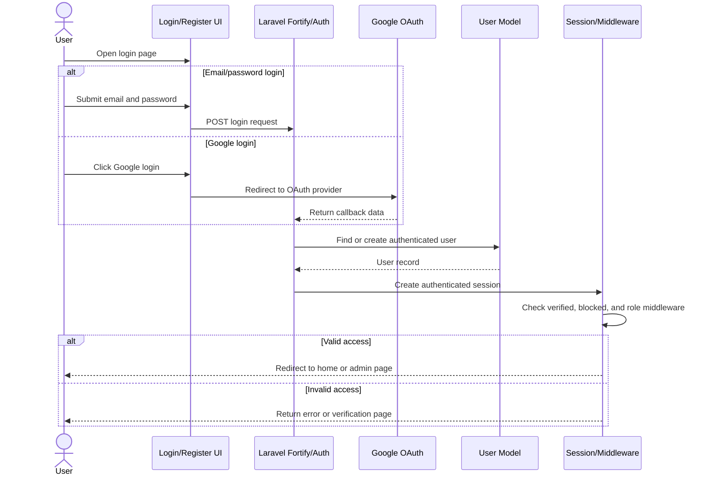

## 2. Browse, Filter, and View Learning Content

该流程覆盖主页 feed、questions page、learning materials page、categories/search，以及打开 post detail 后加载评论、收藏状态、点赞状态、学习材料浏览记录和教师 analytics。

### Activity Diagram

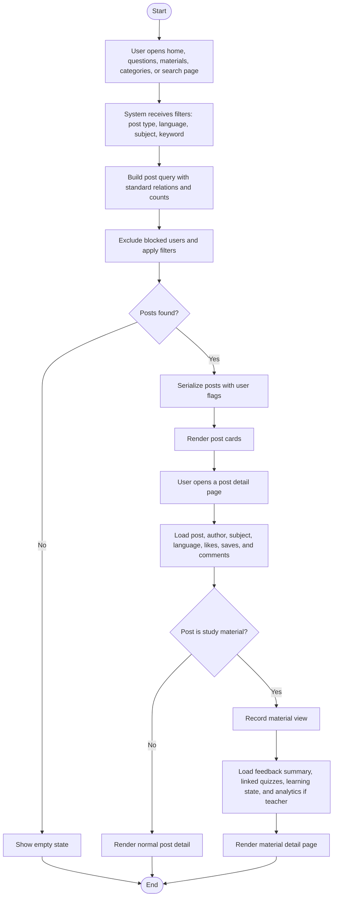

### Sequence Diagram

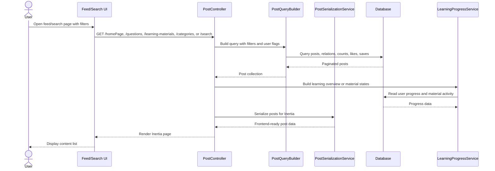

## 3. Create Question, Quiz, or Study Material

该流程覆盖 `POST /posts`，包括学生创建 question/quiz、教师或 admin 发布 study material、文件上传、材料 blocks、linked quizzes、积分、成就和 progress 更新。

### Activity Diagram

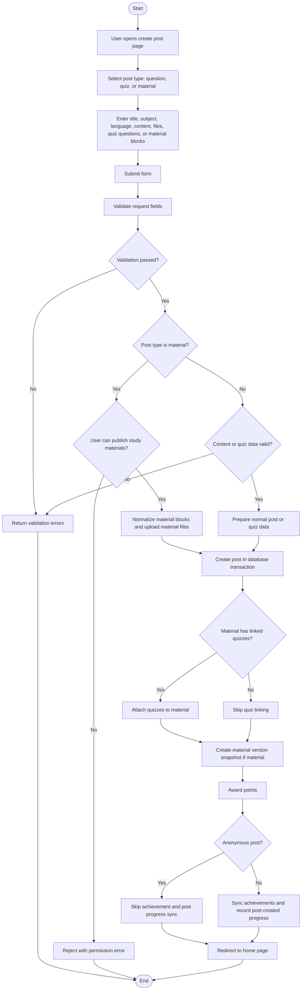

### Sequence Diagram

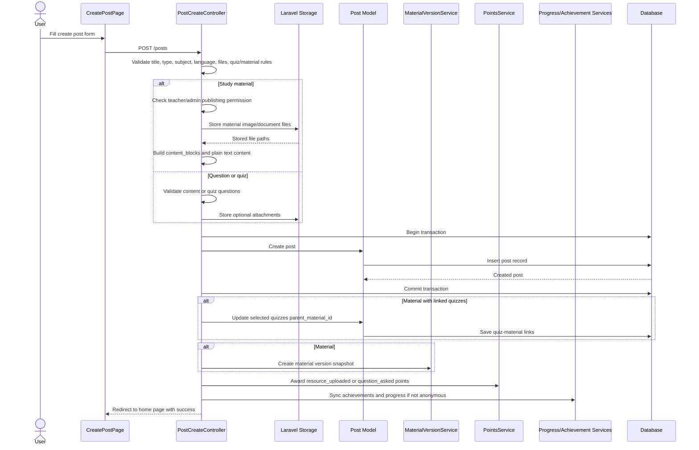

## 4. Comment, Vote, Bookmark, and Report Content

该流程覆盖学习社区的核心互动：评论、回复、评论投票、收藏到 folder，以及举报 post/comment 进入管理员审核队列。

### Activity Diagram

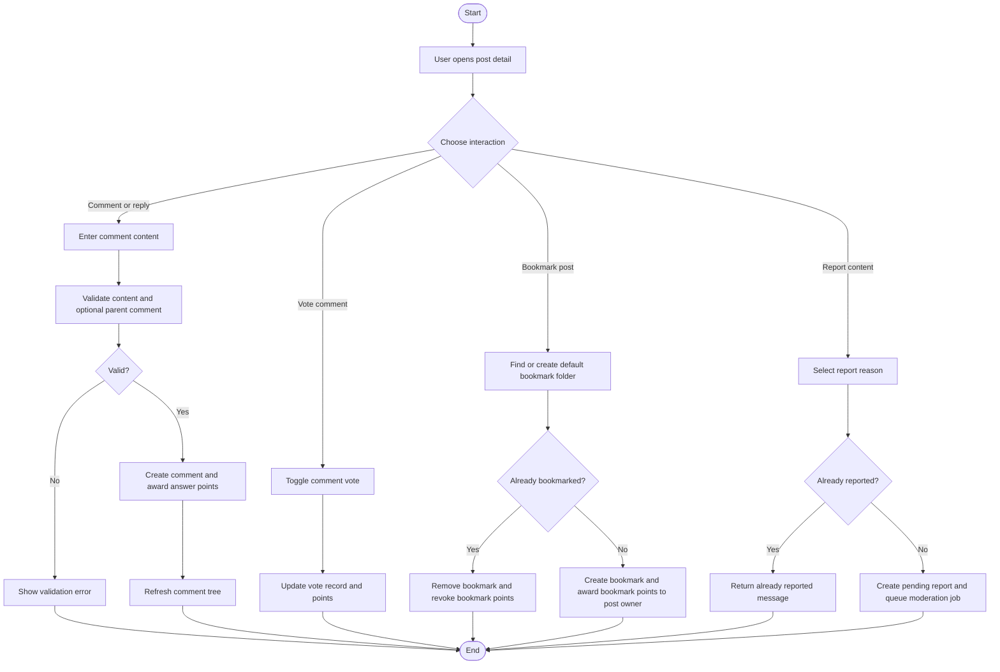

### Sequence Diagram

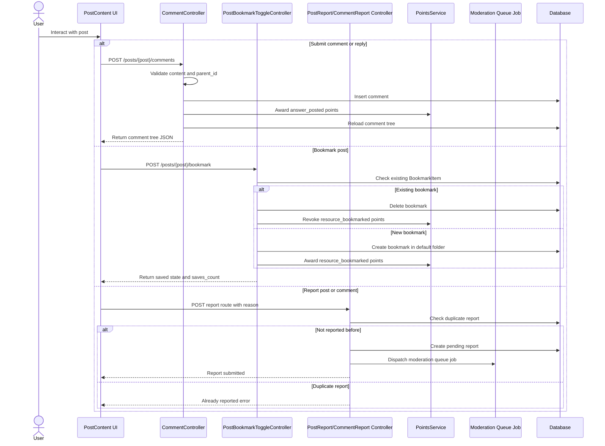

## 5. Attempt Quiz and Update Learning Progress

该流程覆盖 `POST /posts/{post}/complete-quiz`，包括 multi-question quiz、legacy quiz、正确/错误判断、quiz completion、mistake review、material quiz attempt、成就同步。

### Activity Diagram

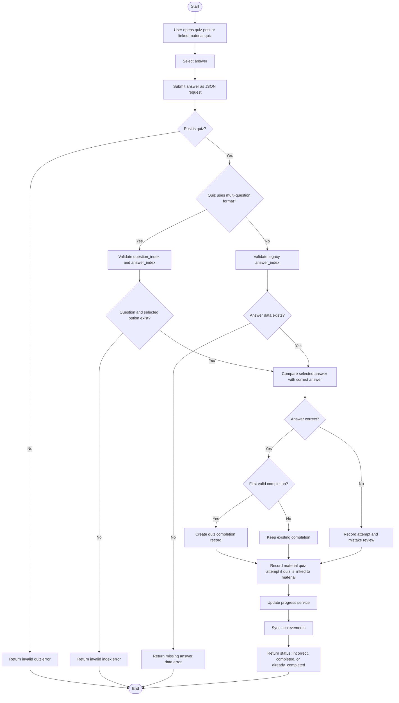

### Sequence Diagram

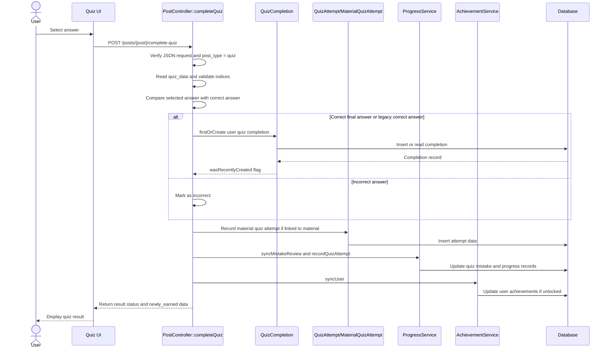

## 6. Admin Governance: Teacher Approval and Content Moderation

该流程覆盖管理员最重要的治理能力：审核教师申请、授予 teacher role / verified status、处理 post/comment reports、删除违规内容或 dismiss report。

### Activity Diagram

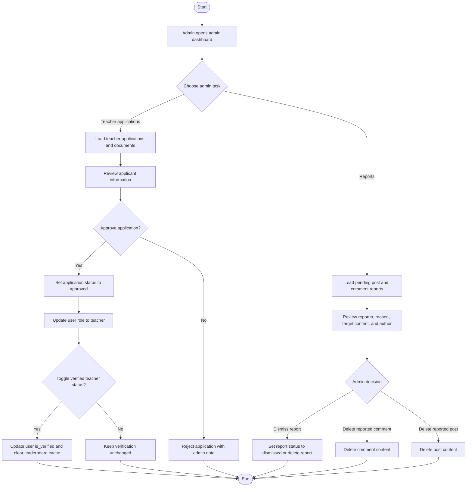

### Sequence Diagram

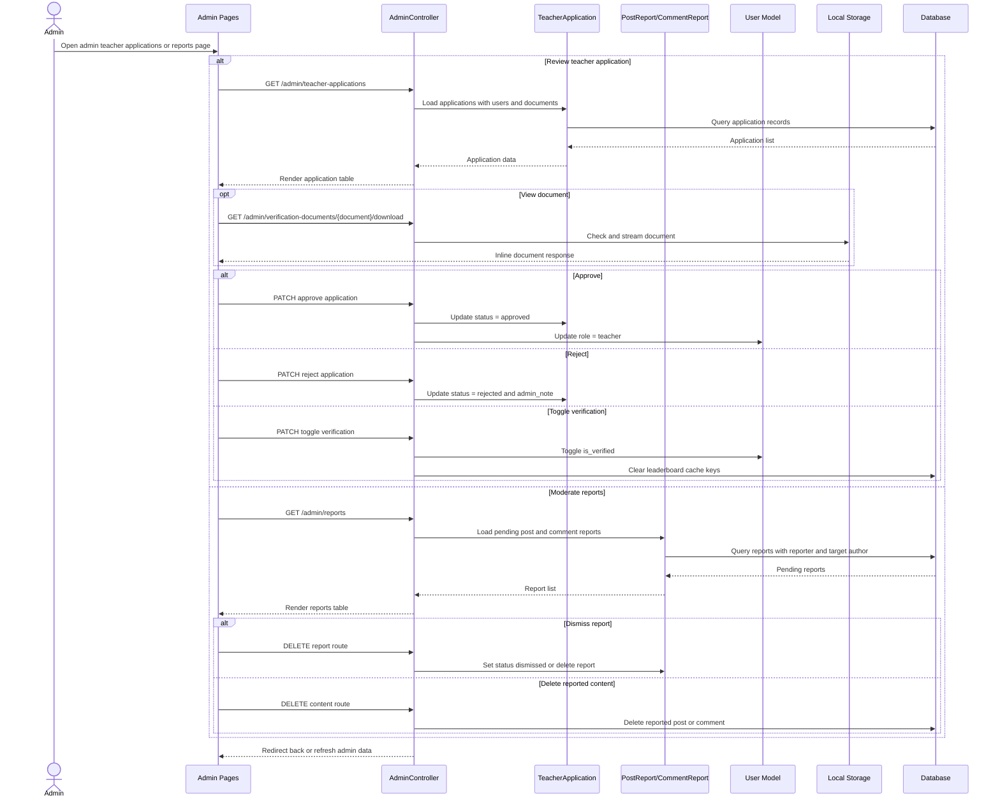

