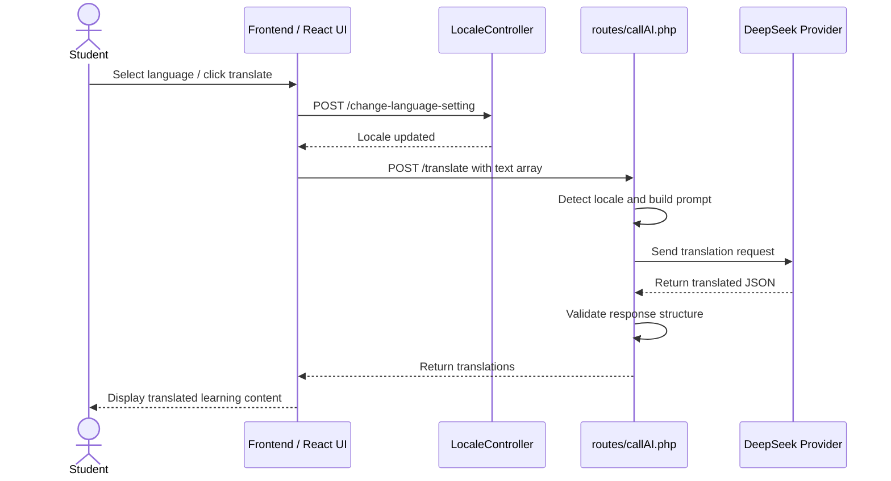
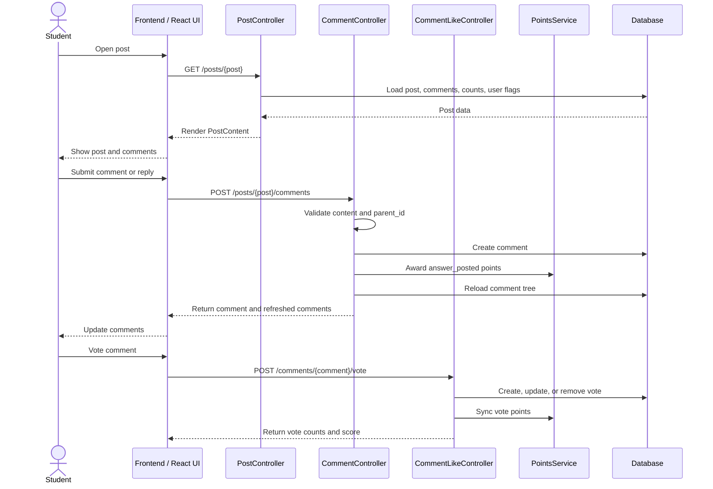
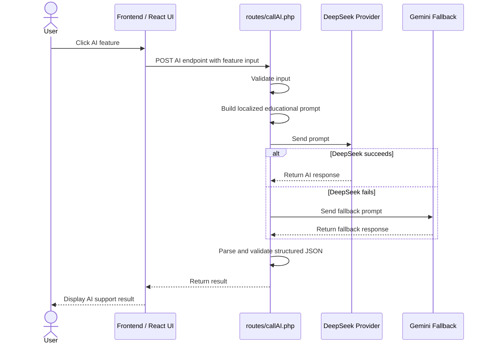
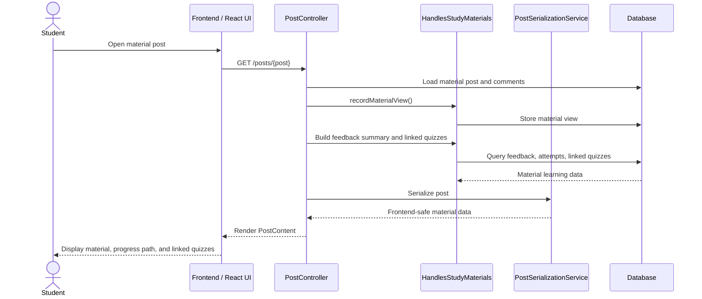
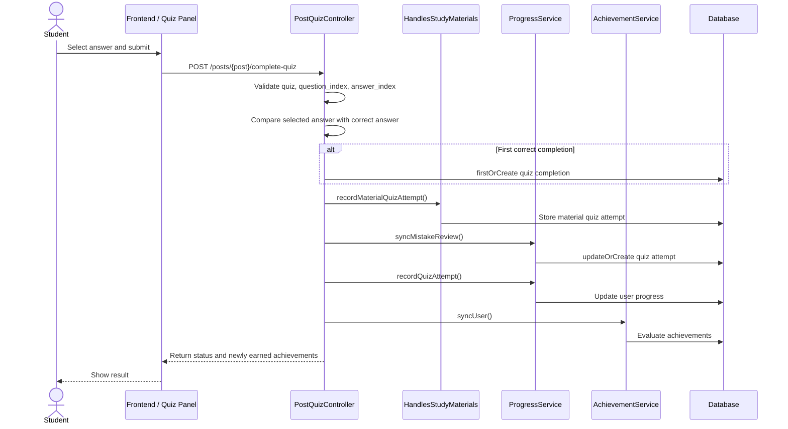
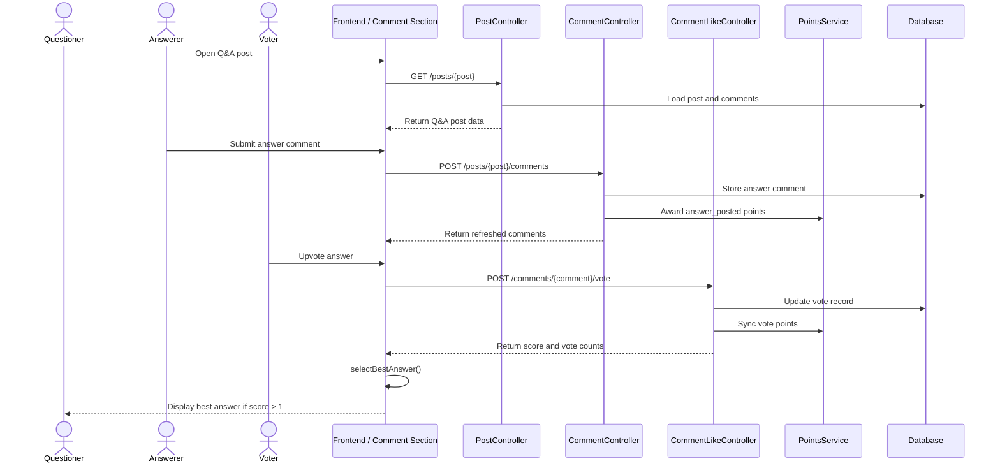

# Sequence Diagram Guide for Six System Functions

This section explains how to draw six important sequence diagrams for the system. Each diagram should show the interaction between the user, frontend, backend controller or route, service layer, database, and external AI provider if involved.

When drawing these diagrams, use these common lifelines where suitable:

- `User` or `Student`
- `Teacher` when the function is teacher-related
- `Frontend / React UI`
- `Laravel Route`
- `Controller`
- `Service`
- `Database`
- `AI Provider`, such as DeepSeek or Gemini

The most important thing is to show the message order clearly. A sequence diagram should not show every small UI state. It should focus on the main request, validation, database update, service processing, and response.

---

## 1. Multilingual Learning Content Display Sequence Diagram

### What this diagram should show

This diagram should show how learning content is displayed in the user's selected language. It can include both normal translated UI text and AI-assisted content translation.

### Main participants

- Student
- Frontend / React UI
- Laravel Route
- `LocaleController`
- `routes/callAI.php`
- DeepSeek AI Provider
- Database

### Code/files to refer to

- `routes/web.php`
- `app/Http/Controllers/LocaleController.php`
- `routes/callAI.php`
- `resources/js/components/post-content/post-translate-actions.tsx`
- `resources/js/components/post-content/use-post-content-controller.ts`

### Sequence to draw

1. Student selects or uses a language setting.
2. Frontend sends language change request to `/change-language-setting`.
3. `LocaleController` updates the application locale/session setting.
4. Student opens a learning post or material.
5. Frontend displays normal UI labels using translation files.
6. If the student clicks translate, frontend sends selected content text to `POST /translate`.
7. Backend detects current locale and builds a translation prompt.
8. DeepSeek translates the text and returns JSON.
9. Backend validates the JSON structure.
10. Frontend replaces the displayed title, content, or material blocks with translated text.

### Mermaid example

### What is needed

- User language preference or current locale.
- Learning content text, title, and material blocks.
- Translation endpoint `/translate`.
- AI provider API key.
- Frontend component that can replace original text with translated text.

---

## 2. Community Post and Comment Interaction Sequence Diagram

### What this diagram should show

This diagram should show how a student opens a post, reads comments, posts a new comment or reply, and how the system refreshes the comment list.

### Main participants

- Student
- Frontend / React UI
- `PostController`
- `CommentController`
- `CommentLikeController`
- `PointsService`
- Database

### Code/files to refer to

- `routes/web.php`
- `app/Http/Controllers/PostController.php`
- `app/Http/Controllers/CommentController.php`
- `app/Http/Controllers/CommentLikeController.php`
- `app/Http/Controllers/Concerns/HandlesPostComments.php`
- `resources/js/components/comment-section.tsx`

### Sequence to draw

1. Student opens a community post.
2. Frontend requests `GET /posts/{post}`.
3. `PostController::show()` loads the post, user flags, comments, likes, saves, and comment counts.
4. Backend returns `PostContent` page data through Inertia.
5. Student submits a comment or reply.
6. Frontend sends `POST /posts/{post}/comments`.
7. `CommentController::store()` validates content and optional parent comment.
8. Backend creates comment in database.
9. `PointsService` awards points for answer/comment posting.
10. Backend reloads comments and returns refreshed comment tree.
11. Frontend updates the comment section immediately.
12. If the student votes on a comment, frontend sends `POST /comments/{comment}/vote`.
13. `CommentLikeController::toggle()` updates vote state and recalculates score.

### Mermaid example

### What is needed

- Authenticated user.
- Post ID.
- Comment content.
- Optional `parent_id` for replies.
- Comment vote direction: `up`, `down`, or `wrong`.
- Database tables: `posts`, `comments`, `comment_likes`, and points transactions.

---

## 3. AI Function Sequence Diagram

### What this diagram should show

This diagram should show the common AI request flow. It can represent AI explanation, quiz option generation, material quiz generation, best answer explanation, answer feedback, learning objectives, or doubt clarification.

### Main participants

- Student or Teacher
- Frontend / React UI
- AI route in `routes/callAI.php`
- DeepSeek Provider
- Gemini Provider, if fallback is shown
- Database, only if the feature needs stored post/comment/material data

### Code/files to refer to

- `routes/callAI.php`
- `AI_FEATURES.md`
- `resources/js/lib/ai-explain.ts`
- `resources/js/lib/ai-quiz-options.ts`
- `resources/js/lib/ai-material-quiz.ts`
- `resources/js/lib/ai-best-answer.ts`
- `resources/js/lib/ai-learning-objectives.ts`
- `resources/js/components/comment-ai-doubt-panel.tsx`

### Sequence to draw

1. User clicks an AI button in the frontend.
2. Frontend collects required input, such as question, options, selected answer, comment, material text, or post title.
3. Frontend sends request to an AI endpoint, for example `/ai-explain` or `/ai-best-answer`.
4. Backend validates the request.
5. Backend builds a prompt based on locale and feature type.
6. Backend sends the prompt to DeepSeek.
7. If DeepSeek succeeds, backend parses and validates JSON.
8. If DeepSeek fails, optional fallback provider such as Gemini can be shown.
9. Backend returns structured JSON to frontend.
10. Frontend renders explanation, feedback, quiz options, or learning objectives.

### Mermaid example

### What is needed

- AI endpoint name.
- Required input for that AI feature.
- Current locale.
- Prompt format.
- Expected JSON structure.
- Provider API key and fallback strategy.
- Frontend panel or component to display the result.

---

## 4. Lesson and Material Access Sequence Diagram

### What this diagram should show

This diagram should show how a student accesses a study material, how the system records material viewing, and how linked quizzes or learning progress are displayed.

### Main participants

- Student
- Frontend / React UI
- `PostController`
- `HandlesStudyMaterials`
- `PostSerializationService`
- Database

### Code/files to refer to

- `routes/web.php`
- `app/Http/Controllers/PostController.php`
- `app/Http/Controllers/Concerns/HandlesStudyMaterials.php`
- `app/Services/PostSerializationService.php`
- `resources/js/components/post-content/study-material/material-post-sections.tsx`
- `resources/js/components/post-content/study-material/study-material-blocks.tsx`

### Sequence to draw

1. Student opens the learning materials page or a specific material post.
2. Frontend requests `GET /learning-materials` or `GET /posts/{post}`.
3. `PostController` loads material posts with standard relations and counts.
4. For a material post, `PostController::show()` calls material-related helper methods.
5. `recordMaterialView()` records that the student viewed the material.
6. Backend builds material feedback summary and user feedback state.
7. Backend loads linked quizzes using `buildLinkedQuizzes()`.
8. Backend builds material learning state/path.
9. `PostSerializationService` converts the post into frontend-safe data.
10. Frontend displays material blocks, learning analytics, feedback section, and linked quizzes.

### Mermaid example

### What is needed

- Material post ID.
- Authenticated user ID.
- Material content blocks.
- Study material view tracking table.
- Feedback and material quiz attempt data.
- Linked quiz relationship through `parent_material_id`.

---

## 5. Quiz Attempt and Result Submission Sequence Diagram

### What this diagram should show

This diagram should show what happens after a student selects an answer and submits a quiz attempt.

### Main participants

- Student
- Frontend / React UI
- `PostQuizController`
- `ProgressService`
- `AchievementService`
- `HandlesStudyMaterials`
- Database

### Code/files to refer to

- `routes/web.php`
- `app/Http/Controllers/PostQuizController.php`
- `app/Services/ProgressService.php`
- `app/Services/AchievementService.php`
- `app/Http/Controllers/Concerns/HandlesStudyMaterials.php`
- `resources/js/components/post-content/use-post-content-controller.ts`
- `resources/js/components/post-content/quiz/post-quiz-panel.tsx`

### Sequence to draw

1. Student selects an answer in the quiz panel.
2. Frontend compares selected answer with local quiz data for immediate UI feedback.
3. Frontend sends `POST /posts/{post}/complete-quiz` with `question_index` and `answer_index`.
4. `PostQuizController::completeQuiz()` checks whether the post is a quiz.
5. Controller decides whether it is a multi-question or single-question quiz.
6. Controller validates question index and answer index.
7. Controller compares selected answer with correct answer.
8. If the quiz is completed for the first time, `QuizCompletion::firstOrCreate()` stores completion.
9. `recordQuizResult()` records material quiz attempt if linked to material.
10. `ProgressService::syncMistakeReview()` updates latest mistake review record.
11. `ProgressService::recordQuizAttempt()` updates learning progress statistics.
12. `AchievementService::syncUser()` checks achievement and badge status.
13. Backend returns `completed`, `already_completed`, or `incorrect`.
14. Frontend updates quiz status and progress-related UI.

### Mermaid example

### What is needed

- Quiz post ID.
- `quiz_data`.
- Selected `question_index`.
- Selected `answer_index`.
- Correct answer index.
- User progress table.
- Quiz completion and quiz attempt records.
- Achievement rules.

---

## 6. Q&A Post and Best Answer Selection Sequence Diagram

### What this diagram should show

This diagram should show how a question post receives answers through comments, how users vote on answers, and how the frontend identifies the best answer.

Important note: in the current implementation, the best answer is selected automatically in the frontend. The `selectBestAnswer()` function chooses the top-level comment with the highest score, and the score must be greater than 1. Voting data comes from `CommentLikeController::toggle()`.

### Main participants

- Student asking question
- Student answering question
- Frontend / React UI
- `PostController`
- `CommentController`
- `CommentLikeController`
- `PointsService`
- Database

### Code/files to refer to

- `routes/web.php`
- `app/Http/Controllers/PostController.php`
- `app/Http/Controllers/CommentController.php`
- `app/Http/Controllers/CommentLikeController.php`
- `resources/js/components/comment-section.tsx`
- `resources/js/components/best-answer-ai-panel.tsx`
- `resources/js/lib/ai-best-answer.ts`

### Sequence to draw

1. Student opens a Q&A post.
2. `PostController::show()` loads the question post and comment tree.
3. Another student posts an answer through `POST /posts/{post}/comments`.
4. `CommentController::store()` validates and stores the answer comment.
5. `PointsService` awards points for posting an answer.
6. Other students vote on the answer using `POST /comments/{comment}/vote`.
7. `CommentLikeController::toggle()` updates upvote, downvote, or wrong vote.
8. Backend returns updated vote count and score.
9. Frontend recalculates comment score.
10. `selectBestAnswer()` sorts top-level comments by score and created time.
11. If the best candidate score is greater than 1, frontend displays it as the best answer.
12. Optional: student clicks AI best answer explanation, frontend calls `/ai-best-answer`.

### Mermaid example

### What is needed

- Q&A post ID.
- Top-level answer comments.
- Comment vote counts.
- Score formula from frontend/backend response.
- Best answer rule: highest score among top-level comments, score must be greater than 1.
- Optional AI explanation endpoint `/ai-best-answer`.

---

# General Advice for Drawing These Sequence Diagrams

Use one diagram per function. Do not put all six functions into one large diagram because it will become too crowded.

For each diagram, prepare:

1. The user action that starts the flow.
2. The frontend component involved.
3. The route or endpoint.
4. The controller or route closure.
5. Any service class involved.
6. The database tables being read or updated.
7. The response returned to the frontend.
8. The final UI result shown to the user.

Recommended diagram style:

- Use `actor` for users.
- Use `participant` for frontend, controller, services, database, and AI provider.
- Use `alt` blocks for conditional logic such as correct/wrong quiz answer, AI fallback, or first-time completion.
- Use short message labels, not full code.
- Keep each diagram around 8 to 15 steps so it is readable during presentation.

Recommended presentation explanation:

> For each sequence diagram, I start from the user's action, then show how the frontend sends the request to Laravel, how the backend validates and processes the data, how the database or AI provider is involved, and finally how the frontend updates the page.

The six diagrams together explain the main learning workflow of the platform:

Student views multilingual content -> Student interacts with posts and comments -> AI supports learning -> Student accesses materials -> Student attempts quizzes -> Q&A answers are voted and best answers are highlighted.
