# Simplified Sequence Diagrams

本文档将 12 个 sequence diagram 简化成 high-level 版本。每个图只保留主要参与者、核心请求、关键判断和最终结果，适合放入 FYP 报告的系统设计章节。

## 1. Login and Registration Sequence Diagram

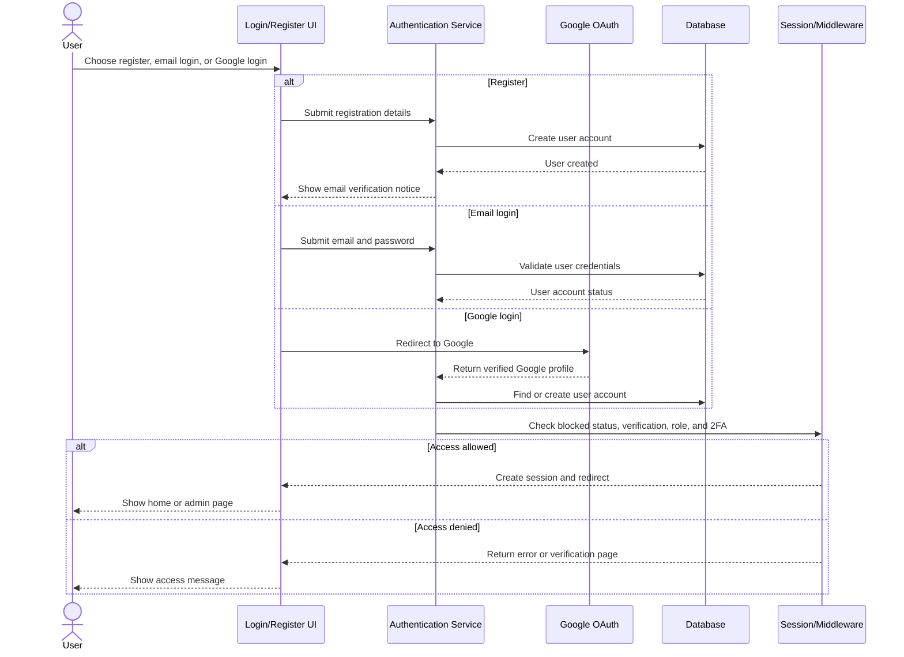

## 2. Create Post Sequence Diagram

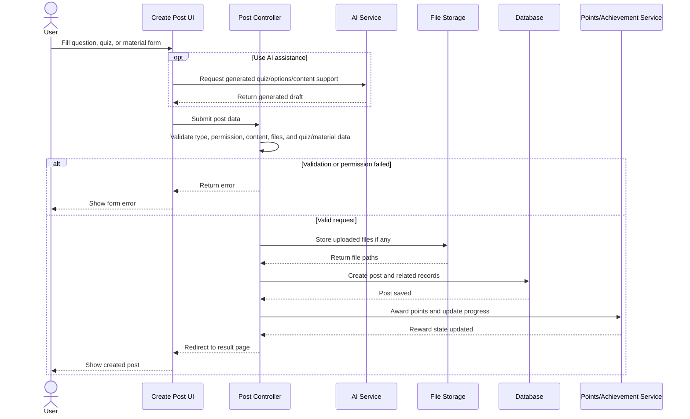

## 3. Switch Language Sequence Diagram

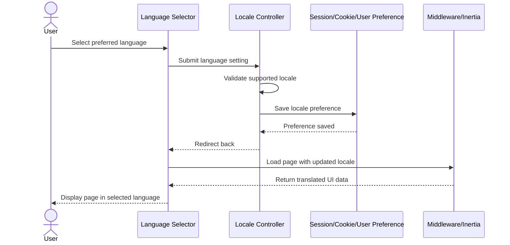

## 4. AI Learning Tools Sequence Diagram

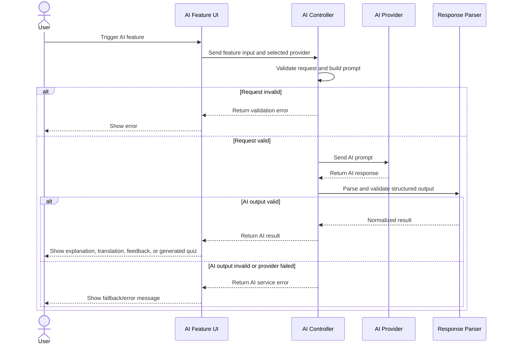

## 5. Follow and Unfollow Sequence Diagram

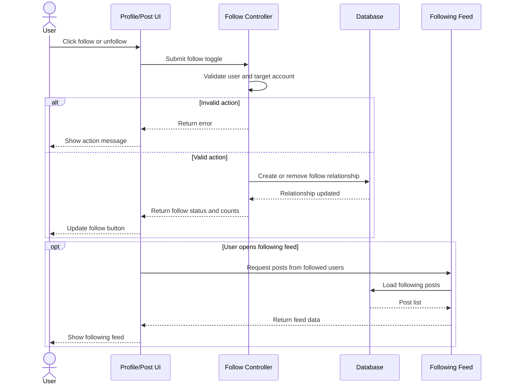

## 6. Bookmark and Study Folder Sequence Diagram

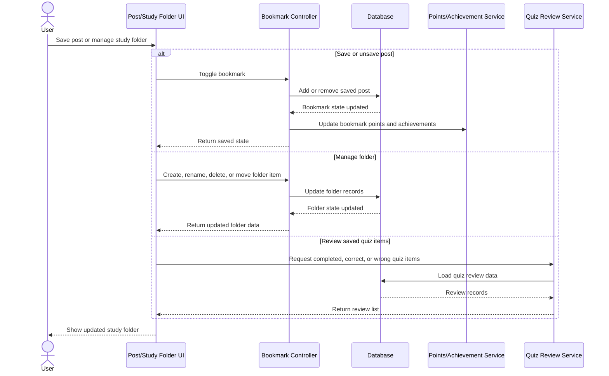

## 7. Achievements Sequence Diagram

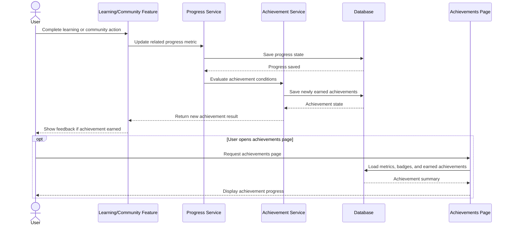

## 8. Leaderboard Sequence Diagram

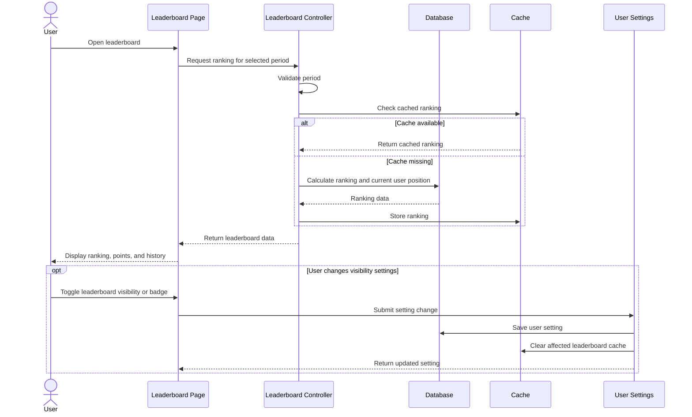

## 9. Teacher Certification Sequence Diagram

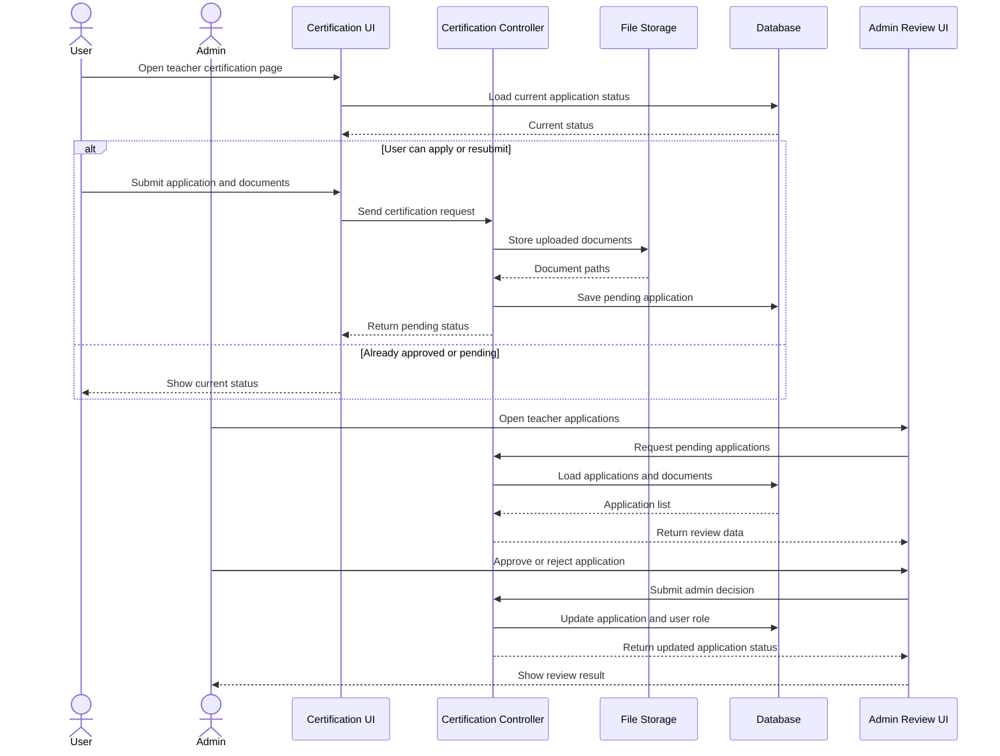

## 10. Comment Sequence Diagram

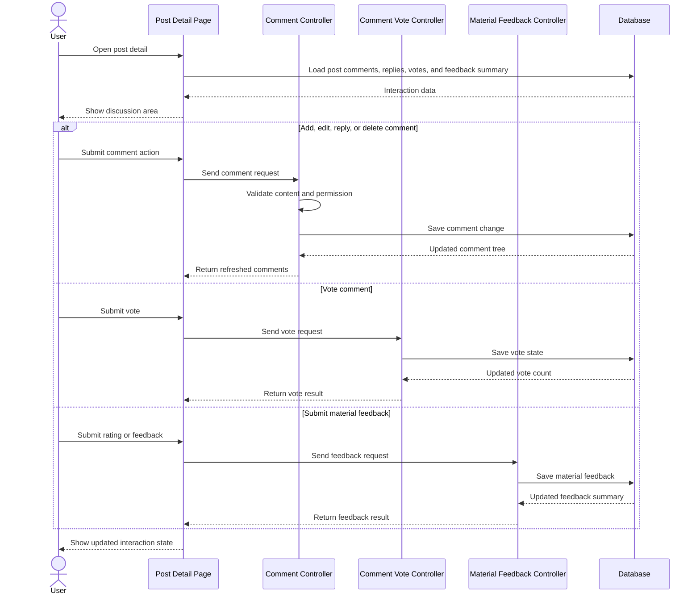

## 11. Admin Block User Sequence Diagram

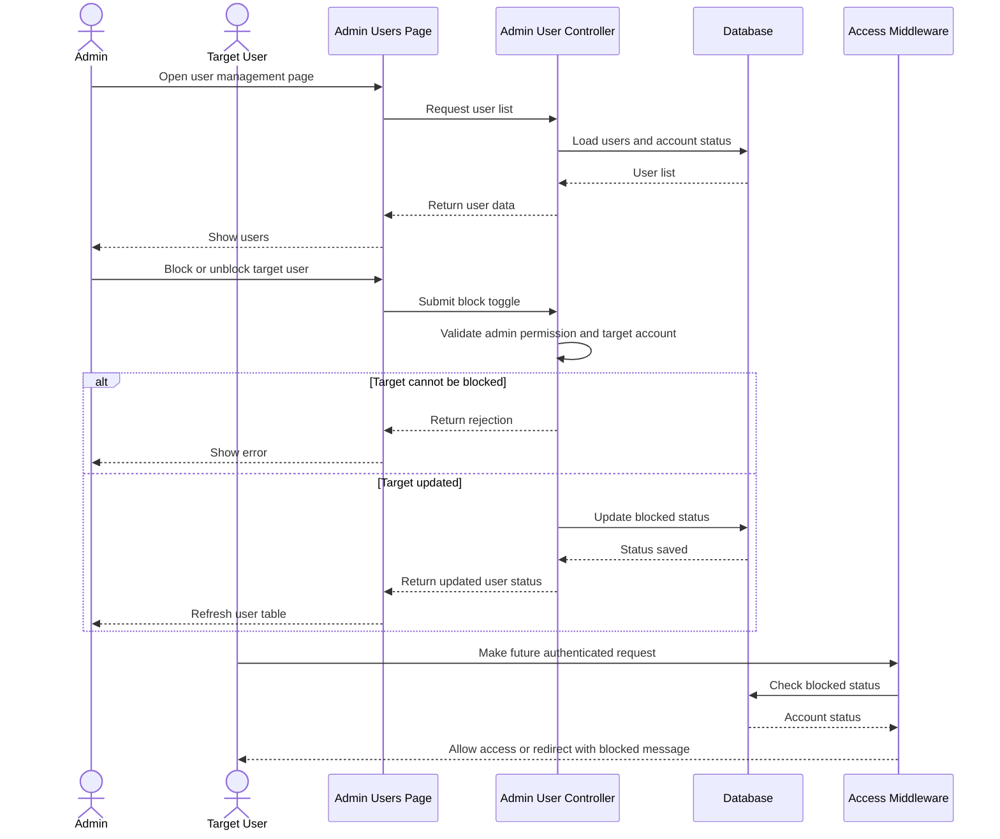

## 12. Report and Admin Moderation Sequence Diagram

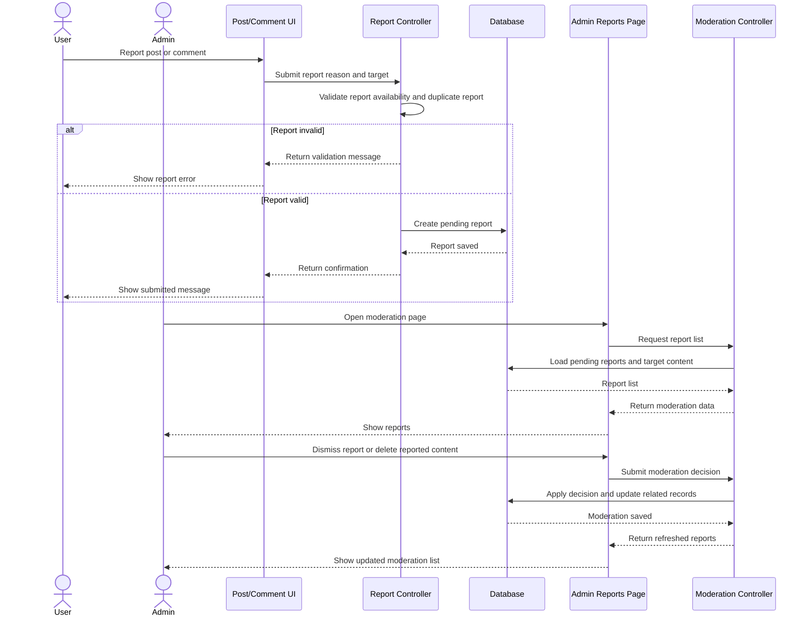
